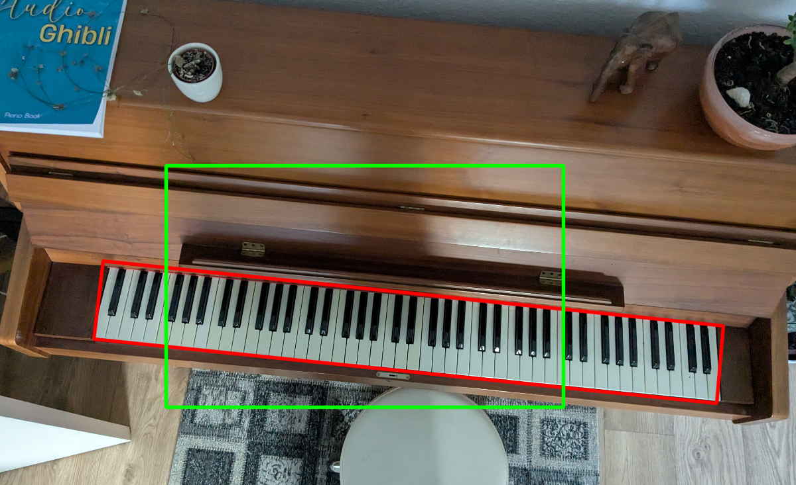

# PianoBeamer

Turn your old fashioned piano into a fancy new one. All you need is a USB Camera and a Beamer. Both should be placed above the piano looking down and have a good view on the keyboard. 

The code base then uses fancy AI tools to detect the keyboard. Then the Beamer projects instructions onto you keyboard which tells you how to play your choosen song.

This code base includes a web app, so you can use your phone too controll which music is projected. It should also work with a raspberry pi, as the computer hosting this. Which enables you to make it all plug and play.

# Install

Use pip to install all needed python packages.

```
pip install mido, torch, opencv, transformers, Flask, albumentations
```
# Usage

Run:

```
python app.py
```

Then go to 127.0.0.1:5000 or wherever Flask tells you your site is hosted.

# Current status:

-Detect Keyboard - Done


-Project Marker Image and detect Markers - Done

-Transformer between keyboard space and image space - Done

-Create a virtual keyboard, with each button individually colorable - Done 

-Read in Music -Done

-Create Webserver -Done

First working Version:

-14.7.2025


# Improvements
Will need to be tested.

Keyboard bounding box is kinda slow (needs to iterate over 90degree turning)

