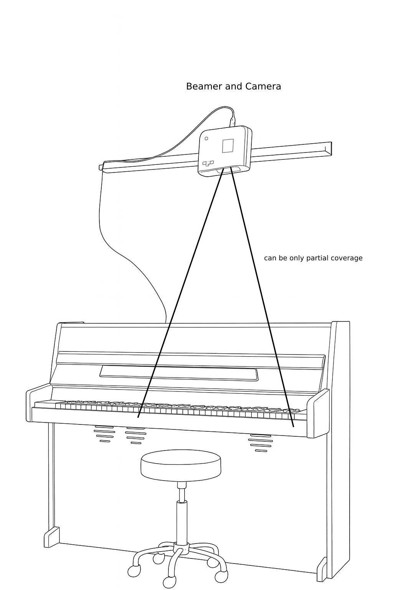
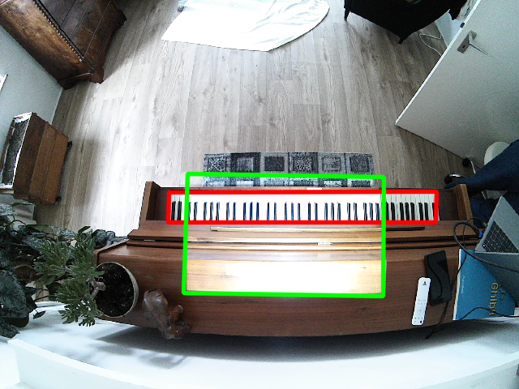

# PianoBeamer

**Turn your acoustic or digital piano into an interactive learning tool.**
With just a USB camera and a beamer (projector), you can project visual cues directly onto your keyboard, guiding you through any chosen song.

The system uses computer vision and AI to automatically detect your keyboard and align the projector output. If the automatic calibration isn’t perfect, you can manually adjust the detection areas for optimal accuracy.

A built-in web application lets you control playback conveniently from your phone or tablet. The system also runs on a Raspberry Pi, making it fully plug-and-play.

 
---

## Short Demo

https://github.com/TheMody/PianoBeamer/images/demo.mp4

---

## Installation

Install the required Python packages with:

```bash
pip install mido torch opencv transformers Flask
```

---

## Usage

1. **Hardware setup**
   Position your beamer above the piano/keyboard, pointing straight down.
   Place the USB camera next to the beamer, also pointing down at the keyboard.

   Example setup:
   

2. **Start the web application**

   ```bash
   python app.py
   ```

   Open [http://127.0.0.1:5000](http://127.0.0.1:5000) (or the address shown in the Flask output) in your browser.

3. **(Optional) Camera undistortion**
   If your camera introduces a fisheye effect, print the calibration pattern:
   

   Affix it to a flat surface (e.g., cardboard or a book) and run the **Undistort Camera** option in the web app.

4. **Calibration**
   Click **Setup & Calibrate** to detect the beamer projection area and the keyboard area.
   Verify that both bounding boxes are placed sensibly in the displayed calibration image. You can manually adjust the edges if needed.

5. **Play a song**
   Choose a song and playback speed in the web interface. The beamer will project the notes directly onto your keys—just follow along!

> **Note:** Calibration and undistortion only need to be done once. Settings are saved and reused on subsequent startups. If you move the beamer or camera, you’ll need to recalibrate.

---

## Current Features

* ✅ Automatic keyboard detection
* ✅ Projection of marker images & marker detection
* ✅ Transformation between keyboard space and image space
* ✅ Virtual keyboard with individually colorable keys
* ✅ MIDI song parsing and playback
* ✅ Web application interface
* ✅ Camera undistortion support

Examples:


---

## Improvements Planned

* Reduce small projection errors
* Investigate individual key detection (challenging but ideal)

