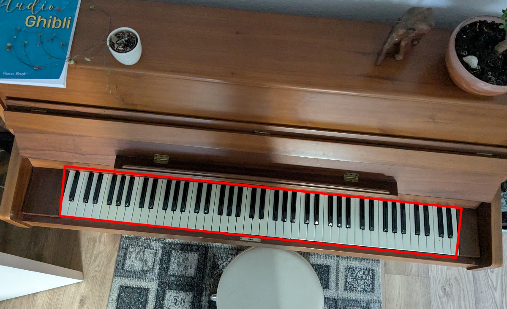

# PianoBeamer

The goal is to detect the keyboard of a piano and use a beamer to project the instructions onto the keyboard.

Current status:

-Detect Keyboard - Done

-Project Marker Image and detect Markers - Done

-Transformer between keyboard space and image space - TODO

-Create a virtual keyboard, with each button individually colorable

-Read in Music